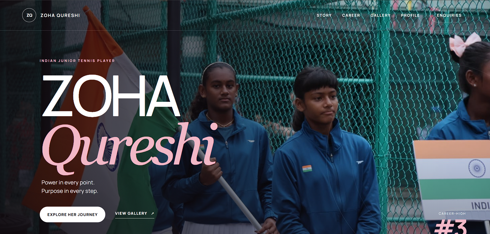

# Zoha Qureshi — Tennis Portfolio Website

A responsive athlete portfolio created for Indian junior tennis player Zoha Qureshi. The website presents her biography, achievements, rankings, gallery and international tennis journey.

## Live Website

https://zoha-qureshi.vercel.app/
## Website Preview

## Features

- Responsive desktop and mobile design
- Athlete biography and career highlights
- Interactive photo gallery
- SEO metadata and Schema.org structured data
- Google Search Console and sitemap integration
- ITF, AITA and UTR profile links

## Technologies

HTML5, CSS3, JavaScript, Vercel, GitHub and technical SEO.

## Author

Designed and developed by Arbaaz Qureshi.

## Content Notice

© 2026 Zoha Qureshi. Photographs and personal content may not be reused without permission. Source code is available for portfolio viewing.
